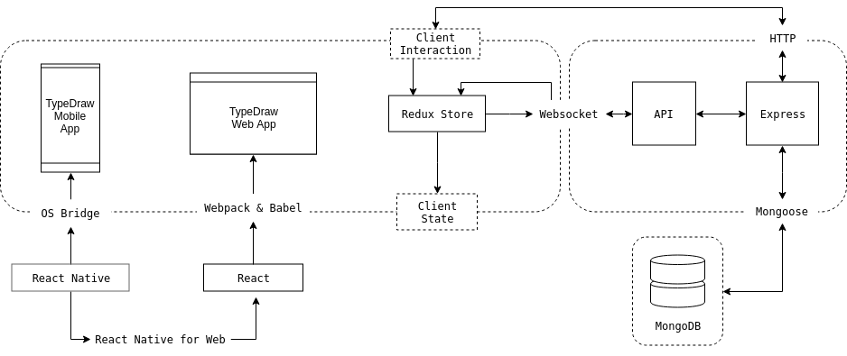
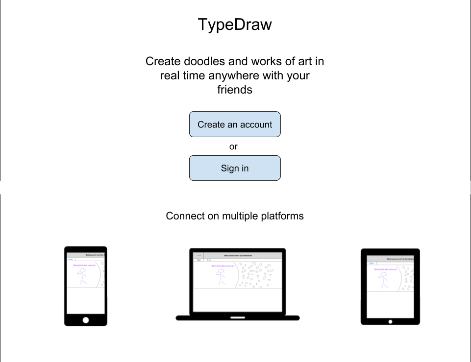
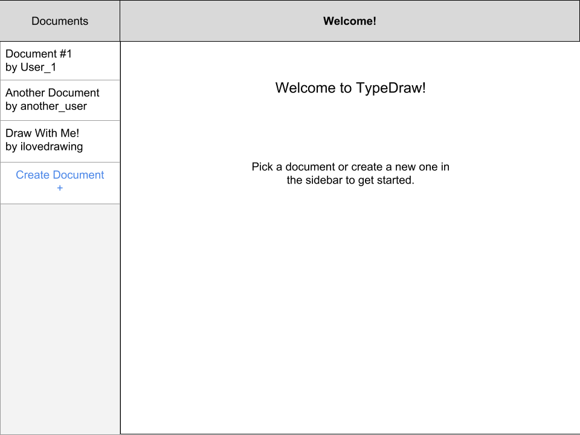
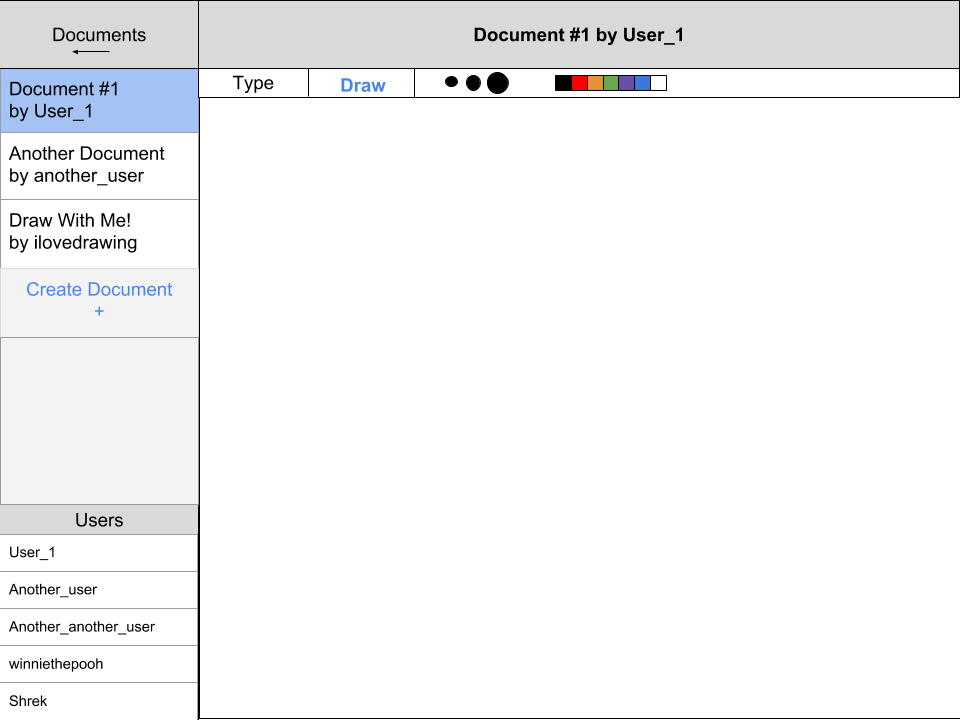
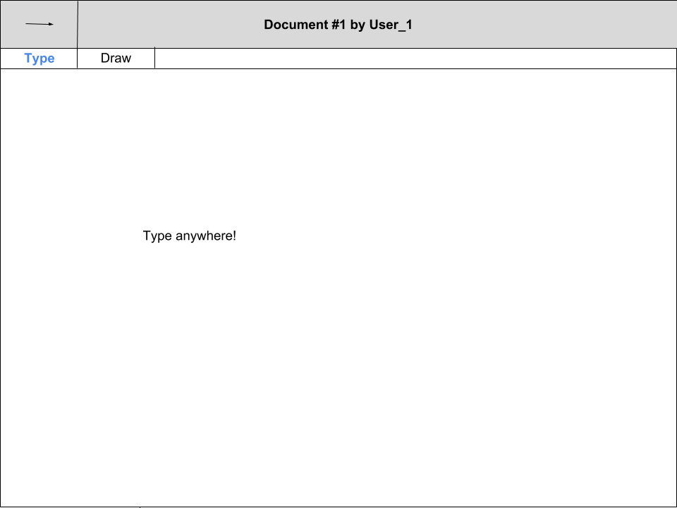

# TypeDraw

_A cross-platform app for real-time collaboration._

[Live Site](https://www.typedraw.app/)

## Background and Overview

TypeDraw is a minimal viable product that tackles three challenges in application development, software engineering, and user experience. These challenges are expressed, respectively, in the following ideals:

- Universal: Without compromising quality, an application that is written once only requires platform-specific changes to be deployed universally.
- Real-time: Communication feels instantaneous. More generally, updates to the state of an application in multiple locations occur with no perceptible delay.
- Seamless: Users can expect a responsive application that is intuitive to use and has a consistent look and feel regardless of the platform.

TypeDraw is primarily built with the MERN stack, a combination of following four technologies: MongoDB, Express, React, and Node.

## Functionality & MVP

- [ ] Documents will have a text editor and a drawing pad layered on top of each other so that users can type and draw at the same time
- [ ] Documents support multi-user document sharing by allowing invitations to other users through either Facebook or Gmail
- [ ] Real-time communication between devices (Mobile and Browser)
- [ ] Session persistence across devices allowing for changes to be seen as they are made
- [ ] Web and mobile application (iOs)

### Bonus Features

- [ ] Getting on the App Store
- [ ] Uploading a text document and allowing our app to draw over it
- [ ] End-to-end encryption
- [ ] Document Parsing to parse over different type of document text files, and generating our own extension with drawing on top of the document
- [ ] Group chat and voice chat for users to communicate as they are drawing and/or typing up a document

## Technologies & Challenges

### Architecture

The overall application architecture is geared toward rapid development and maintainability of an application that is deployed on both web and mobile.

To that end, TypeDraw is built with the MERN stack (MongoDB, Express, React, and Node). It features a frontend agnostic API servicing both web and mobile in conjunction with client side rendering with React.

Additionally, React Native is used for mobile development, bundling of client-side javascript is accomplished by Webpack, and Babel is used to transpile ES6+ Javascript for backward browser compatibility.

The overall architecture is summarized in the diagram below:

#### Backend: Node, Express, MongoDB

The backend will be entirely platform agnostic with the exception of potential performance optimizations per platform. The separation of the back and front allows for either to be modified, built, updated, or swapped out entirely with minimal impact to the other.

TypeDraw's back-end HTTP API is expected to be relatively small since it's role is limited to retrieving user records and establishing a websocket connection to rapidly synchronize data between users.

Despite significant advances in both the software and infrastructure of the web, achieving scaleable, real-time communication is still a non-trivial challenge. The requirements to meet this challenge are a particularly well-suited use case for a noSQL database:

- TypeDraw has only two models (users and documents), and a fixed schema is not preferable for either model.
- Relations between models are simple and inexpensive to query without a relational database.
- Nearly all of the data is unstructured text or image data that is not well suited for relational databases.
- Most importantly, low-latency/availability is preferred over a guarantee of immediate consistency.

#### Frontend: React and React Native with Redux

Increasing code reuse across platforms is essential to achieving a rapid development cycle and a codebase that is more easily maintained.

Given that mobile devices support web technology (JS, HTML, CSS), the typical approach to building mobile and web applications simultaneously has been to begin by building the web application and then running a modified version of that application in a mobile WebView. However, this approach tends toward creating mobile applications that still feel distinctly like web applications.

TypeDraw's solution is to take the opposite approach and begin by writing all components in React Native. From there, the React Native for Web package will be used to adapt the existing components for use in TypeDraw's web app.

### Realtime Communication
We will be incorporating websockets with our app to implement real-time communication between our users. 

Our server will be listening for incoming connections and will establish a connection between clients through the WebSocket handshake when a request is made by a client.

We will be managing real-time display of changes by processing information from the upstream and downstream communications between our server and the clients.
### Cross-Platform Typing & Drawing

Our aim with this project is to create a cohesive experience across all web browsers for both mobile and desktop users. Users must be able to type, draw, and collaboratively edit documents, regardless of platform.

While building our application in React Native will allow us to utilize a platform's various native components, we are faced with the challenge of creating a drawing and text-editing UI that looks good and functions uniformly.

Along with React Native, we plan to use a **multi-layer approach** to the editor itself - a bottom layer for text-editing, with an **HTML5 Canvas** layer above. This will give collaborators the ability to easily add comments, make changes, or mark up a document.

## UI/UX

The goal is to make a sleek and intuitive interface for users to be able to pick up and engage with quickly. Pages will be self explanatory with a minimal feel as to not overwhelm users.

The app will consist of a single page upon logging in with a welcome banner and a sidebar that can be used for navigation between different document rooms. The sidebar will collapse upon entering a document room for a full-screen experience with a clickable tab to reopen the sidebar in order to navigate elsewhere.

Document pages will start out as a blank canvas and include a toolbar to switch between text and drawing modes with their own prospective editing tools such as font size and pen width.

The top of the screen will feature an unobtrusive fixed bar for document information such as name and creator, a log out button, and links to the GitHub repository as well as a dropdown menu with links to each contributing developer's information.

### Wireframes

#### Splash Page

#### Welcome Page

#### Draw Page (with sidebar)

#### Type page (no sidebar)

## Group Members & Work Breakdown

**Zaniar Moradian**,
**Mason Anders**,
**Matt Moe**,
**Aidan Gadberry**

## Attribution

Device mockup images in splash-page wireframe are by [Danilo De Marco](http://www.danilodemarco.com/)
